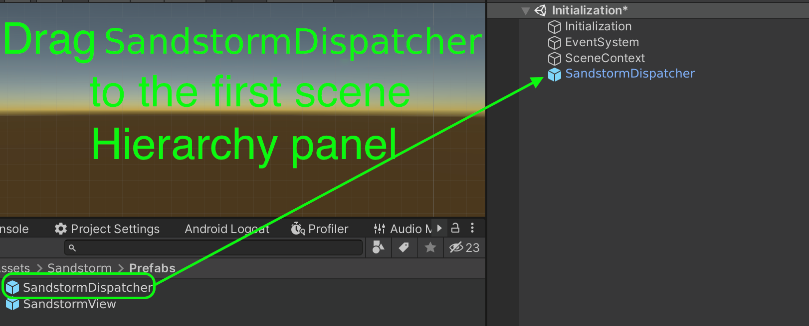
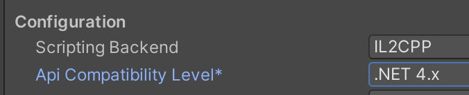
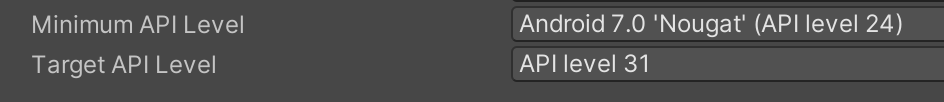
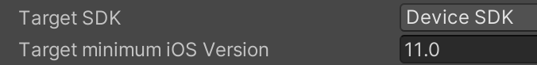
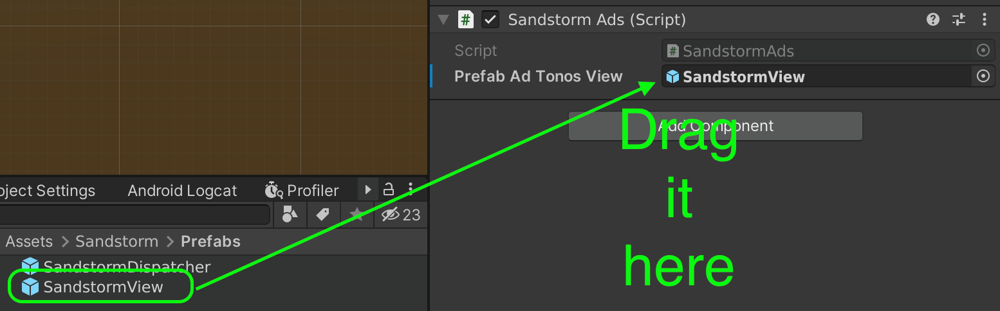
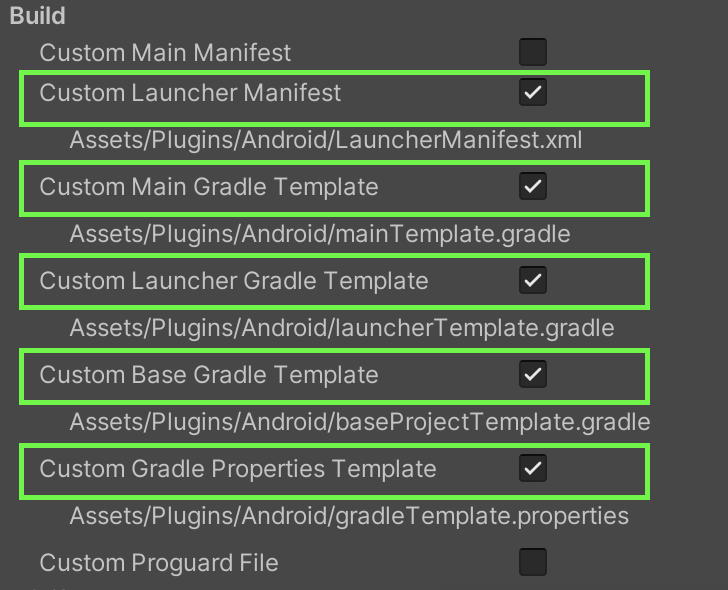

# Sandstorm SDK for Unity

Sandstorm SDK provides in-game, intermission and bounty audio ads and allows publishers to generate new revenues from world-class brands.

## Requirements
* Unity version 2020.3.23f1 LTS
* iOS 11 (device only, simulator is currently not supported)
* Android minimum target 24
* [External Dependency Manager for Unity](https://github.com/googlesamples/unity-jar-resolver) - However, this documentation also describes the manual way without External Dependency Manager for Unity
* This library has been tested for compatibility with Facebook SDK, Firebase SDK, Google Mobile Ads SDK, Unity Ads and others. In case of problems, please make sure that all libraries are used in the latest versions.

## Setup

Below are the instructions required to configure the library properly. Read it carefully before applying any changes.

### Unity 3d
#### Choose SDK versions

You have to decide which version of SDK you want to use.
Two available:
* **SandstormSDK** - contains SDK functionality + extra user targeting provided by [NumberEight](https://numbereight.ai); this version will ask user for extra permissions (i.e. location)
* **SandstormLiteSDK** - contains SDK functionality without extra user targeting; this version won't ask user for extra permissions

```text
NumberEight is a AI software, which predicts the live context of a user (e.g. running, commuting) from sensors present in the device, and then packages them neatly into ID-less behavioural audiences (e.g. joggers, frequent shoppers).
```
Import to your Unity project `SandstormSDK.unitypackage` or `SandstormLiteSDK.unitypackage` according to your decision.

#### Editor setup
Currently, the library only works on the Android and iOS platforms. Operation in Unity Editor may be unspecified.

After importing the unitypackage, add the SandstormDispatcher prefab (found in Sandstorm/Prefabs/SandstormDispatcher.prefab) to the hierarchy of the first scene.

See attached image:



Ensure Scripting Backend is set to IL2CPP and API Compatibility Level is set to .NET 4.x



#### Stripping

If there are problems with [striping](https://docs.unity3d.com/Manual/ManagedCodeStripping.html), create a link.xml file in the Assets directory and add the following content to it:

```xml
<linker>
    <assembly fullname="Sandstorm" preserve="all"/>
</linker>
```

### Android

Please note the minimum requirements of the Android version. API Level should be set to at least version 24, and target to at least version 31.



There are two possible ways to import a library for the Android platform. The first one (faster) using External Dependency Manager for Unity and the manual one, when this tool is not in the project. Both ways will be described below.

#### Android - External Dependency Manager

If you already have External Dependency Manager in your project,
just click on the top toolbar and choose accordingly: Assets/External Dependency Manager/Android Resolver/Resolve.

Then find the "Publishing Settings" section (Edit/Project Settings/Player/Android) and check 4 checkboxes there: "Custom Launcher Manifest", "Custom Main Gradle Template", "Custom Base Gradle Template", "Custom Gradle Properties Template". This will create 4 new files which you then need to edit accordingly.

#### baseProjectTemplate.gradle External Dependency Manager

In the "baseProjectTemplate.gradle" file, find the "repositories" section and add the following entry to it:

```groovy
// Only if you're using SandstormSDK, not SandstormLiteSDK
maven {
    url 'https://repo.numbereight.ai/artifactory/gradle-release-local'
}
```

An example of what such section might look like:

```groovy
repositories {**ARTIFACTORYREPOSITORY**
        google()
        jcenter()
        flatDir {
            dirs "${project(':unityLibrary').projectDir}/libs"
        }
        // Only if you're using SandstormSDK, not SandstormLiteSDK
        maven {
            url 'https://repo.numbereight.ai/artifactory/gradle-release-local'
        }
    }
```

#### mainTemplate.gradle External Dependency Manager

In the "mainTemplate.gradle" file, find the "dependencies" section and add the following entries to it.

```groovy
// Only if you're using SandstormSDK, not SandstormLiteSDK
implementation('ai.numbereight.sdk:nesdk:3.4.0@aar') {
    transitive = true
}
// Only if you're using SandstormSDK, not SandstormLiteSDK
implementation 'ai.numbereight.sdk:audiences:3.4.0'
```

An example of what such a section might look like:

```groovy
apply plugin: 'com.android.library'
**APPLY_PLUGINS**


dependencies {
    implementation fileTree(dir: 'libs', include: ['*.jar'])
    implementation('ai.numbereight.sdk:nesdk:3.4.0@aar') {
        transitive = true
    }
    implementation 'ai.numbereight.sdk:audiences:3.4.0'
**DEPS**}
```

#### LauncherManifest.xml External Dependency Manager

In the "LauncherManifest.xml" file located in the Assets/Plugins/Android, add following lines inside manifest tag:

```xml
<uses-permission android:name="com.google.android.gms.permission.AD_ID"/>

<!-- Add following lines only for SandstormSDK, not SandstormLiteSDK -->
<uses-permission android:name="android.permission.ACCESS_FINE_LOCATION" />
<uses-permission android:name="android.permission.ACCESS_COARSE_LOCATION"/>
<uses-permission android:name="android.permission.ACCESS_NETWORK_STATE" />
<uses-permission android:name="android.permission.ACCESS_WIFI_STATE" />
<uses-permission android:name="android.permission.READ_PHONE_STATE" />
<uses-feature android:name="android.hardware.sensor.accelerometer" android:required="true" />
```

And following lines inside application tag:

```xml
<activity android:name="com.siroccomobile.adtonos.thundersdk.ui.ThunderActivity" android:theme="@style/AppTheme.Transparent" />
```

An example of what such section might look like:

```xml
<?xml version="1.0" encoding="utf-8"?>
<!-- GENERATED BY UNITY. REMOVE THIS COMMENT TO PREVENT OVERWRITING WHEN EXPORTING AGAIN-->
<manifest
    xmlns:android="http://schemas.android.com/apk/res/android"
    package="com.unity3d.player"
    xmlns:tools="http://schemas.android.com/tools"
    android:installLocation="preferExternal">

    <uses-permission android:name="com.google.android.gms.permission.AD_ID"/>
    <uses-permission android:name="android.permission.ACCESS_FINE_LOCATION" />
    <uses-permission android:name="android.permission.ACCESS_COARSE_LOCATION"/>
    <uses-permission android:name="android.permission.ACCESS_NETWORK_STATE" />
    <uses-permission android:name="android.permission.ACCESS_WIFI_STATE" />
    <uses-permission android:name="android.permission.READ_PHONE_STATE" />

    <!-- Recommended to ensure the device has at least an accelerometer -->
    <uses-feature android:name="android.hardware.sensor.accelerometer" android:required="true" />

    <supports-screens
        android:smallScreens="true"
        android:normalScreens="true"
        android:largeScreens="true"/>

    <application android:extractNativeLibs="true"
                 android:label="@string/app_name"
                 android:icon="@mipmap/app_icon">
        
        <activity android:name="com.siroccomobile.adtonos.thundersdk.ui.ThunderActivity" android:theme="@style/AppTheme.Transparent" />
        
    </application>
```

#### gradleTemplate.properties External Dependency Manager

In the "gradleTemplate.properties" file, ensure that the following entries are added or already exist:

```text
android.useAndroidX=true
android.enableJetifier=true
```

An example of what such a file might look like:

```text
org.gradle.jvmargs=-Xmx**JVM_HEAP_SIZE**M
org.gradle.parallel=true
android.enableR8=**MINIFY_WITH_R_EIGHT**
unityStreamingAssets=.unity3d**STREAMING_ASSETS**
android.useAndroidX=true
android.enableJetifier=true

**ADDITIONAL_PROPERTIES**
```

### iOS

The library has been tested for buildability for Xcode versions 12 and 13. However, version 13 is the recommended version. The process of building a package on iOS involves adding a description of the permissions used by the library. The whole thing can be found in the Assets/Editor/SandstormPostBuildiOS.cs file. There are a few strings there, which by default populate the appropriate fields in the Xcode project settings. These fields can be edited freely, and if the build process is more complex the whole code can be disabled. However, be sure to define the appropriate permissions in your Xcode project.

Be sure to set the minimum iOS version to 11, as in the attached image:


Also it is recommended to add extra frame on pause:


#### iOS - External Dependency Manager

We are using [CocoaPods](https://cocoapods.org) for managing dependencies. Generated Xcode project will contain ready to use **.workspace** file. This should be the file you use everyday to build your iOS app.

## Using the SDK

### Initialization

The first necessary step in the project is to call the ATSandstormSDK.Initialize method. It should be called at the start of the application, when the other components are created. The method is safe to be called multiple times. The Initialize method must be called every time the application starts. Below is an example of how this should be done:

```Csharp
//other using..
using Sandstorm;

public class Initialization : MonoBehaviour
{
    void Awake() 
    {
        ATSandstormSDK.Initialize(context: new SandstormUnityContext(), dispatcher: FindObjectOfType<SandstormDispatcherUnity>());
    }
}
```

### Start

The library requires certain permissions and user consents for data collection. Therefore, one of the initial screens should show the user the terms and conditions containing the necessary information about the use and processing of personal data. This is done when the user first interacts with the application, so this is a good time to call the Start method. The method takes the consent flag as a parameter and then asks the user for the system permissions necessary for the application to work. The start method must be called every time the application starts. Additionally, the LoadLatestConsents method can be used, which returns the most recently granted consents. Below is an example of how this can be done:

```Csharp
///It can be called up from the main menu or any other suitable place
public void OnAppStarted() {
    if (CanShowPrivacyPolicyPopup()) {
        ShowPrivacyPolicyPopup(); //when ended shall call OnPrivacyPolicyPopupClosed
    } else {
        // You have to set NumberEight key before calling Start method.
        // Only if you're using SandstormSDK, not SandstormLiteSDK.
        ATSandstormSDK.SetNumberEightKey("YOUR_KEY");

        ATSandstormSDK.Start(ATSandstormSDK.LoadLatestConsents() ?? AdTonosConsent.None);
    }
}

public void OnPrivacyPolicyPopupClosed(AdTonosConsent consent) {
    // You have to set NumberEight key before calling Start method.
    // Only if you're using SandstormSDK, not SandstormLiteSDK.
    ATSandstormSDK.SetNumberEightKey("YOUR_KEY");

    //result param consent depends of the user consent. If user agrees then AllowAll, if he doesn't then None.
    ATSandstormSDK.Start(consent);
}

public bool CanShowPrivacyPolicyPopup()
{
    return ATSandstormSDK.LoadLatestConsents() == null;
}


```

### Playing Ads

There are several steps to follow in order to play the ads. First of all, using the SandstormVastUrlBuilder, enter the Sandstorm key. The next step is to make a request for ads using the RequestForAds method. One of its parameters is the prefab found in Assets/Sandstorm/Prefabs/SandstormView.prefab. The next steps are to wait for the ads to be obtained and to run the ads. A callback can be useful here to provide information about the current state and any errors. Below is an example of a class that will cause an advertisement to play.

```Csharp

public class SandstormAds : MonoBehaviour, SandstormCallback
{
        private bool IsAdsLoaded {get; set;}

        //rest of the code
        //[...]
        ///

        private SandstormUnityView CreateSandstormUnity() 
        {
            ...
        }

        IEnumerator PlayAds()
        {

            yield return new WaitUntil(() => ATSandstormSDK.IsStarted());
            ATSandstormSDK.AddCallback(this);
            IsAdsLoaded = false;

            // You can set default banner on-screen position for banner ads.
            // This step is optional; default position is top of the screen
            ATSandstormSDK.SetAdBannerPosition(SandstormBannerPosition.Bottom);

            var builder = ATSandstormSDK.CreateBuilder();
            builder.SetAdTonosKey(""); //THIS MUST BE SET TO VALUE FROM AdTonos

            // Set ad type you want to request.
            // Two types available:
            // - Regular - just audio ad,
            // - BannerAd - audio ad with clickable banner on screen.
            // This is optional - if you won't set it, SandstormAdType.Regular will be used.
            var adType = SandstormAdType.BannerAd;
            builder.SetAdType(adType);

            var requestResult = ATSandstormSDK.RequestForAds(builder: builder, view: CreateSandstormUnity());

            if (requestResult == SandstormAdRequestResult.Success)
            {
                yield return new WaitUntil(() => IsAdsLoaded);
                if (ATSandstormSDK.PlayAd() == false) {
                    // Handle error or retry request later.
                    ATSandstormSDK.Clear();
                    Debug.Log("Can't play ads");
                }
            }
            else
            {
                Debug.Log("implement some error handling");
            }


            yield return null;

        }

        public void OnVastAdsLoaded()
        {
            Debug.Log("VastAdsLoaded");
            IsAdsLoaded = true;
        }

        public void OnVastError(SandstormError vastError)
        {
            Debug.Log($"OnVastError {vastError}");
        }

        public void OnVastAdsAvailabilityExpired()
        {
            Debug.Log("OnVastAdsAvailabilityExpired");
        }

        public void OnVastAdsStarted()
        {
            Debug.Log("OnVastAdsStarted");
        }

        public void OnVastAdPaused()
        {
            Debug.Log("OnVastAdPaused");
        }

        public void OnVastAdPlayStarted()
        {
            Debug.Log("OnVastAdPlayStarted");
        }

        public void OnVastAdsEnded()
        {
            Debug.Log("OnVastAdsEnded");
        }

        public void OnStarted()
        {
            Debug.Log("OnStarted");
        }

}
```

Delivering SandstormView can be done in a number of ways. If a DI framework is used, you can use it to create such an object. Below is the simplest method of delivery by dragging and using the Instantiate method.



```Csharp

[SerializeField]
private GameObject _prefabSandstormView;

private SandstormUnityView CreateSandstormUnity()
{
    var gm = Instantiate(_prefabSandstormView, Vector3.zero, Quaternion.identity);
    //Additional settings to AudioSource, e.g. adding mixers etc.
    return gm.GetComponent<SandstormUnityView>();
}

```

### Clearing and Disposing

You can call the Clear() method at any time, which will stop the playback and clear the current state of the ad playback. After calling the Clear method, the ad request must be executed again. The Clear method also executes automatically when the ad playback has finished or after critical errors that prevent playback.

To release the memory used by the library completely, call the Dispose method. This is usually done when exiting the application. Note that after the Dispose method is executed, the only way to restore ad functionality is to call Initialize and Start again.

### Other methods

Please see documentation to get information about possible errors and other methods that can be invoked.

## System permissions

During the first startup, the library will ask the user to grant system permissions. The process is automatic.

### Android system permissions

The following system permissions are used by the library. They will be merged during build, so you do not need to declare them again in the application manifest.

```xml
<uses-permission android:name="com.google.android.gms.permission.AD_ID"/>
<!-- Required for SandstormSDK -->
<uses-permission android:name="android.permission.ACCESS_FINE_LOCATION" />
<uses-permission android:name="android.permission.ACCESS_COARSE_LOCATION"/>
<uses-permission android:name="android.permission.ACCESS_NETWORK_STATE" />
<uses-permission android:name="android.permission.ACCESS_WIFI_STATE" />
<uses-permission android:name="android.permission.READ_PHONE_STATE" />
<uses-feature android:name="android.hardware.sensor.accelerometer" android:required="true" />
<uses-feature android:name="android.hardware.location" android:required="false" />
<uses-feature android:name="android.hardware.sensor.gyroscope" android:required="false" />
<uses-feature android:name="android.hardware.sensor.barometer" android:required="false" />
<uses-feature android:name="android.hardware.sensor.compass" android:required="false" />
<uses-feature android:name="android.hardware.sensor.light" android:required="false" />
<uses-feature android:name="android.hardware.sensor.proximity" android:required="false" />
```

### iOS system permissions

The following keys describe the required system permissions

```xml
<!-- Required for both SandstormSDK and SandstormLiteSdk -->
<key>NSUserTrackingUsageDescription</key>
<string>This identifier will be used to deliver personalized ads to you.</string>
<!-- Required only for SandstormSDK -->
<key>NSLocationWhenInUseUsageDescription</key>
<string>To determine the type of place the user is situated in while interacting with the app.</string>
<key>NSMotionUsageDescription</key>
<string>To determine physical interaction with the device while using the app.</string>
```

## Consents

Below is a list of what is included in the AdTonosConsent.AllowAll option

* `PROCESSING` - Allow processing of data.
* `SENSOR_ACCESS` - Allow use of the device's sensor data.
* `STORAGE` - Allow storing and accessing information on the device.
* `USE_FOR_AD_PROFILES` - Allow use of technology for personalised ads.
* `USE_FOR_PERSONALISED_CONTENT` - Allow use of technology for personalised content.
* `USE_FOR_REPORTING` - Allow use of technology for market research and audience insights.
* `USE_FOR_IMPROVEMENT` - Allow use of technology for improving  products.
* `LINKING_DEVICES` - Allow linking different devices to the user through deterministic or probabilistic means.
* `USE_OF_DEVICE_INFO` - Allow use of automatically provided device information such as manufacturer, model, IP addresses and MAC addresses.
* `USE_FOR_SECURITY` - Allow use of independent identifiers to ensure the secure operation of systems.
* `USE_FOR_DIAGNOSTICS` - Allow processing of diagnostic information using an independent identifier to ensure the correct operation of systems.
* `PRECISE_GEOLOCATION` - Allow use of precise geolocation data (within 500 metres accuracy).

## AppStore Data Guide

Since the release of iOS 14.5, developers must now declare the data they use in the App Privacy section of App Store Connect. In order to assist you in declaring the correct data being collected, we have created an simple guide.

>**Important**
If you are unsure what you need to declare, we recommend seeking advice from an appropriate professional.

Further information on what is now required can be found on the [Apple developer section for app privacy details](https://developer.apple.com/app-store/app-privacy-details/).

* Step 1: Edit Data Types
To declare the data sources used by ThunderSDK, select the App Privacy section on your app’s App Store settings page, and click Edit next to Data Types.
* Step 2: Usage Data.
  
  * Go to Usage Data section.
  * Select Other Usage Data.

* Step 3: Location Data Types.
  
  * Go to Location section.
  * Select Precise Location.
  * Select Coarse Location.
  
* Step 4: Justify the Data Used.
  
  Once the data used has been selected, you need to justify what the data is used for.
  * Back to App Privacy.
  * Click on Edit next to Precise Location in Location section.
  * For each of the data types listed above, you should select Developer’s Advertising or Marketing
* Step 5: Data Linkage
  
  You may also need to declare whether the data is linked to the user’s identity, or whether it is used for tracking. In both cases, ThunderSDK does not track users’ identites.

## Manual Configuration

### Manual Configuration Android (without External Dependency Manager)

In a Unity3d project in which you have already imported the Sandstorm library, select "Edit" from the top menu and then "Project settings...".  Then find the "Player" field and select the tab with the Android icon.
Expand the "Publishing Settings" section. In this section, find and select the 5 checkboxes: "Custom Launcher Manifest", "Custom Main Gradle Template", "Custom Launcher Gradle Template", "Custom Base Gradle Template", "Custom Gradle Properties Template". This will create 5 new files which you then need to edit accordingly.

See attached image:



#### LauncherManifest.xml Manual

In the "LauncherManifest.xml" file located in the Assets/Plugins/Android, add following lines inside manifest tag:

```xml
<uses-permission android:name="com.google.android.gms.permission.AD_ID"/>
<!-- Required only for SandstormSDK, not SandstormLiteSDK -->
<uses-permission android:name="android.permission.ACCESS_FINE_LOCATION" />
<uses-permission android:name="android.permission.ACCESS_COARSE_LOCATION"/>
<uses-permission android:name="android.permission.ACCESS_NETWORK_STATE" />
<uses-permission android:name="android.permission.ACCESS_WIFI_STATE" />
<uses-permission android:name="android.permission.READ_PHONE_STATE" />

<uses-feature android:name="android.hardware.sensor.accelerometer" android:required="true" />
```

And following lines inside application tag:

```xml
<activity android:name="com.siroccomobile.adtonos.thundersdk.ui.ThunderActivity" android:theme="@style/AppTheme.Transparent" />
```

An example of what such section might look like:

```xml
<?xml version="1.0" encoding="utf-8"?>
<!-- GENERATED BY UNITY. REMOVE THIS COMMENT TO PREVENT OVERWRITING WHEN EXPORTING AGAIN-->
<manifest
    xmlns:android="http://schemas.android.com/apk/res/android"
    package="com.unity3d.player"
    xmlns:tools="http://schemas.android.com/tools"
    android:installLocation="preferExternal">

    <uses-permission android:name="com.google.android.gms.permission.AD_ID"/>
    <uses-permission android:name="android.permission.ACCESS_FINE_LOCATION" />
    <uses-permission android:name="android.permission.ACCESS_COARSE_LOCATION"/>
    <uses-permission android:name="android.permission.ACCESS_NETWORK_STATE" />
    <uses-permission android:name="android.permission.ACCESS_WIFI_STATE" />
    <uses-permission android:name="android.permission.READ_PHONE_STATE" />

    <!-- Recommended to ensure the device has at least an accelerometer -->
    <uses-feature android:name="android.hardware.sensor.accelerometer" android:required="true" />

    <supports-screens
        android:smallScreens="true"
        android:normalScreens="true"
        android:largeScreens="true"/>

    <application android:extractNativeLibs="true"
                 android:label="@string/app_name"
                 android:icon="@mipmap/app_icon">
        
        <activity android:name="com.siroccomobile.adtonos.thundersdk.ui.ThunderActivity" android:theme="@style/AppTheme.Transparent" />
        
    </application>
```

#### baseProjectTemplate.gradle Manual

In the "baseProjectTemplate.gradle" file, find the "repositories" section and add the following entry to it:

```groovy
// Required only for SandstormSDK, not SandstormLiteSDK
maven {
    url 'https://repo.numbereight.ai/artifactory/gradle-release-local'
}
```

An example of what such section might look like:

```groovy
repositories {**ARTIFACTORYREPOSITORY**
        google()
        jcenter()
        flatDir {
            dirs "${project(':unityLibrary').projectDir}/libs"
        }
        // Required only for SandstormSDK, not SandstormLiteSDK
        maven {
            url 'https://repo.numbereight.ai/artifactory/gradle-release-local'
        }
    }
```

#### gradleTemplate.properties Manual

In the "gradleTemplate.properties" file, ensure that the following entries are added or already exist:

```text
android.useAndroidX=true
android.enableJetifier=true
```

An example of what such a file might look like:

```text
org.gradle.jvmargs=-Xmx**JVM_HEAP_SIZE**M
org.gradle.parallel=true
android.enableR8=**MINIFY_WITH_R_EIGHT**
unityStreamingAssets=.unity3d**STREAMING_ASSETS**
android.useAndroidX=true
android.enableJetifier=true

**ADDITIONAL_PROPERTIES**
```

#### launcherTemplate.gradle Manual

In the "launcherTemplate.gradle" file, find the "dependencies" section and add the dependency for "multidex" to it as in the example below:

```groovy
implementation "androidx.multidex:multidex:2.0.1"
```

An example of what such a section might look like:

```groovy
dependencies {
    implementation project(':unityLibrary')
    implementation "androidx.multidex:multidex:2.0.1"
    }
```

Also in the same file, find the "android" section and inside it the "defaultConfig" section. Here you should enable the option "multiDexEnabled" by setting the flag to true.

```groovy
multiDexEnabled true  
```

example:

```groovy
defaultConfig {
        minSdkVersion **MINSDKVERSION**
        targetSdkVersion **TARGETSDKVERSION**
        applicationId '**APPLICATIONID**'
        ndk {
            abiFilters **ABIFILTERS**
        }
        versionCode **VERSIONCODE**
        versionName '**VERSIONNAME**'
        multiDexEnabled true  
    }
```

In the "android" section, make sure the JAVA version is set to 1.8. If the entry below does not exist, add it.

```groovy
 compileOptions {
        sourceCompatibility JavaVersion.VERSION_1_8
        targetCompatibility JavaVersion.VERSION_1_8
    }
```

example of all changes:

```groovy
dependencies {
    implementation project(':unityLibrary')
    implementation "androidx.multidex:multidex:2.0.1"
    }

android {
    compileSdkVersion **APIVERSION**
    buildToolsVersion '**BUILDTOOLS**'

    compileOptions {
        sourceCompatibility JavaVersion.VERSION_1_8
        targetCompatibility JavaVersion.VERSION_1_8
    }

    defaultConfig {
        minSdkVersion **MINSDKVERSION**
        targetSdkVersion **TARGETSDKVERSION**
        applicationId '**APPLICATIONID**'
        ndk {
            abiFilters **ABIFILTERS**
        }
        versionCode **VERSIONCODE**
        versionName '**VERSIONNAME**'
        multiDexEnabled true  
    }
```

#### mainTemplate.gradle Manual

In the "mainTemplate.gradle" file, find the "dependencies" section and add the following entries to it.

```groovy
// Required only for SandstormSDK, not SandstormLiteSDK
implementation('ai.numbereight.sdk:nesdk:3.4.0@aar') {
    transitive = true
}

implementation 'org.jetbrains.kotlinx:kotlinx-coroutines-android:1.3.9'
implementation 'com.google.android.gms:play-services-ads-identifier:17.1.0'
implementation 'com.google.guava:guava:28.0-android'
implementation 'ai.numbereight.sdk:audiences:3.4.0'
implementation "org.jetbrains.kotlin:kotlin-stdlib:1.5.31"
implementation 'androidx.core:core-ktx:1.7.0'
implementation 'androidx.appcompat:appcompat:1.4.0'
```

An example of what such a section might look like:

```groovy
apply plugin: 'com.android.library'
**APPLY_PLUGINS**


dependencies {
    implementation fileTree(dir: 'libs', include: ['*.jar'])
    implementation('ai.numbereight.sdk:nesdk:3.4.0@aar') {
        transitive = true
    }
    implementation 'org.jetbrains.kotlinx:kotlinx-coroutines-android:1.3.9'
    implementation 'com.google.android.gms:play-services-ads-identifier:17.1.0'
    implementation 'com.google.guava:guava:28.0-android'
    implementation 'ai.numbereight.sdk:audiences:3.4.0'
    implementation "org.jetbrains.kotlin:kotlin-stdlib:1.5.31"
    implementation 'androidx.core:core-ktx:1.7.0'
    implementation 'androidx.appcompat:appcompat:1.4.0'
**DEPS**}
```

Also in the same file, find the "android" section and inside it, make sure you set the JAVA version to 1.8. If the entry below does not exist, add it.

```groovy
 compileOptions {
        sourceCompatibility JavaVersion.VERSION_1_8
        targetCompatibility JavaVersion.VERSION_1_8
    }
```

### Manual Configuration iOS (without External Dependency Manager)

If not installed, install [CocoaPods](https://cocoapods.org).

#### Using ThunderSDK published pod (recommended)

After building the iOS project, add or edit `Podfile` by adding the following lines to the target UnityFramework

```text
target 'UnityFramework' do
    # add only one of the following
    pod 'ThunderSDK' # add this line if you're using SandstormSDK
    pod 'ThunderLiteSDK' # add this line if you're using SandstormLiteSDK
end
target 'Unity-iPhone' do
end
```

Next, run command below, while in the Xcode project directory.

```bash
pod install
```

If you get error `CocoaPods could not find compatible version for ...` then try to run `pod repo update` before `pod install`.
After a successful install, you can open and build the project by selecting **Unity-iPhone.xcworkspace**

#### Using ThunderSDK local copy pod

The first step is to copy the ThunderSDK.xcframework and ThunderSDK.podspec files to a directory on disk. Then edit the podspec file by changing its path. An example can be found below:

```text
    s.source            = { :http => 'file:///Users/Sandstorm/library/ThunderSDK.xcframework' }
```

After building the iOS project, add or edit the Podfile by adding the following lines to the target UnityFramework

```text
target 'UnityFramework' do
    pod 'ThunderSDK', :path => 'FULL_PATH_TO_DIR/ThunderSDK.podspec'
end
target 'Unity-iPhone' do
end
```

In the example, modify the path to the podspec file so that it matches the real path on disk, e.g:

```text
pod 'ThunderSDK', :path => '/Users/Sandstorm/library/ThunderSDK.podspec'
```

Next, run command below, while in the Xcode project directory.

```bash
pod install
```

After a successful install, you can open and build the project by selecting **Unity-iPhone.xcworkspace**
